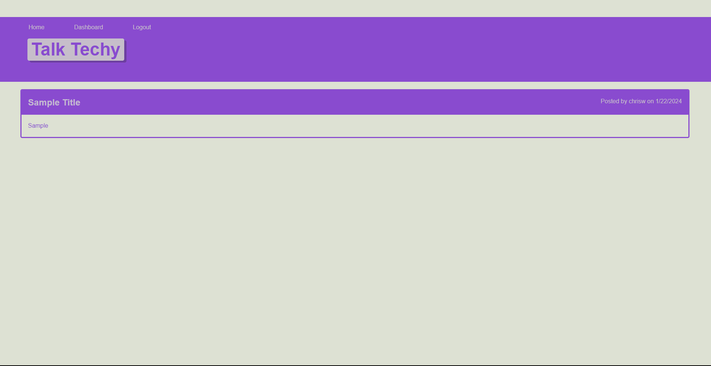
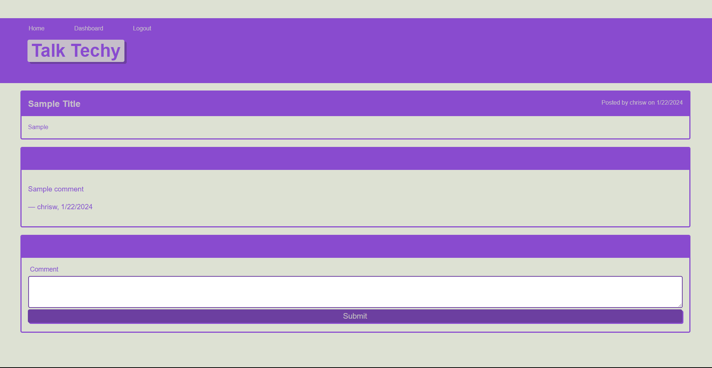

# Talk Techy

## Description

The purpose of this project is to learn how to use the MVC folder/file structure and Express Handlebars to create a tech blog. The motivation for this project  was to enhance full-stack development and solidify an understanding of various NPM packages, front-end coding, and route controlling. This project was built to create an application that allows users to create an account that persists through a database, create new blog posts, and comment on blog posts. 

## Installation

N/A

## Usage

As this project is a full-stack application, users will be able to use the application via the link provided down below. Once users land on the homepage, they will see existing blog posts from other create users. Clients may signup for an account or login to an existing account in order to create their own posts or comment on other posts. Users will note that they are not able to access the dashboard or create a new post with a signed-in account. 

## Credits

Handlebars for view templates used the project. Bycrypt for password hashing. Express for packages used in routing and creating sessions. MySQL used for application database. Diarmuid Murphy and Megan Meyers for assistance through creation of the application in understanding concepts and improving code; also for providing the CSS template used to style the application

## Link(s)

https://cw-tech-blog-708e9a3dff69.herokuapp.com/ (Link to deployed application)
https://github.com/chriswaje/tech-blog (Link to GitHub repository)

## Image(s)

